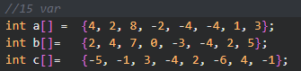
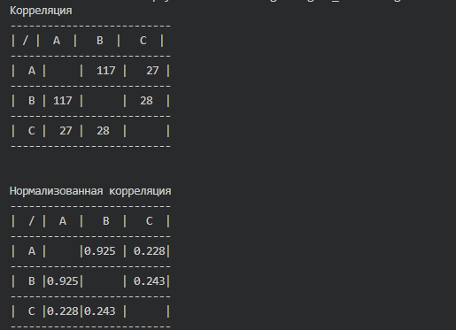
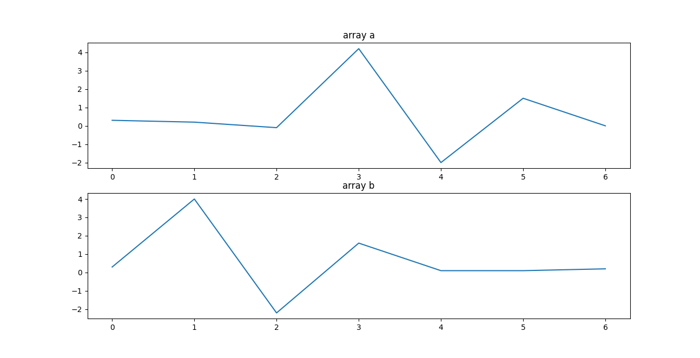
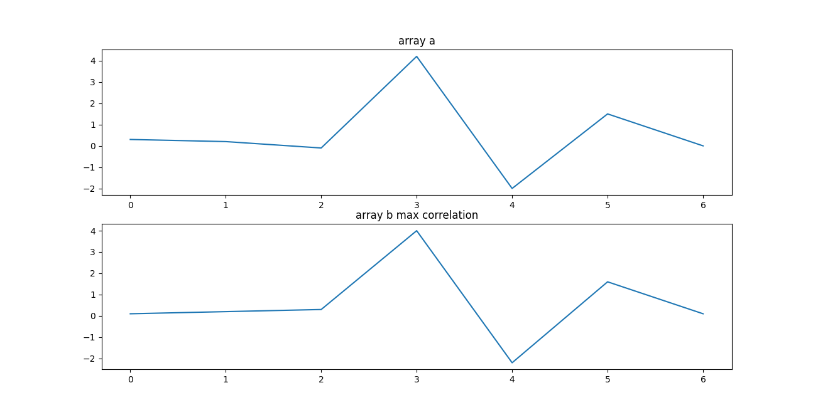
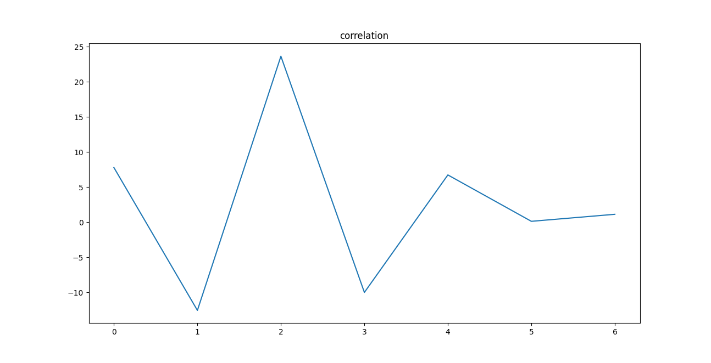

# Занятие №3. Корреляция дискретных сигналов

## Задание
1. Напишите на языке C/C++ функцию вычисления корреляции и
нормализованной корреляции между массивами a, b и с



2. Выведите в терминале полученные значения в виде таблицы

## Реализация:

- Функция для Корелляции:
```c
int Correlations(int a[], int b[]){
    int correl = 0 ;

    for (int i=0; i < 8; i++){
        correl+= a[i]*b[i] ;   
    }
    return correl;
}
```

- Функция для Нормализованной корелляции:
```c
float Norm_Correlat(int a[], int b[]){
    int sum_a=0, sum_b = 0, cor_a_b=0;
    for (int i = 0; i < 8; i++ ){
        sum_a+=a[i]*a[i];
        sum_b+=b[i]*b[i];
    }
    cor_a_b = Correlations(a,b);
    float res =(cor_a_b/sqrt(sum_a*sum_b));
    return res;
}
```



3. Определите корреляцию и нормализованую
корреляцию между сигналами a и b

```py
Корелляция :  18.125
Нормализованная корелляция :  0.03269908386187454
```
4. Возьмите два массива значений и выведите их на графиках друг под
другом

```py
a1 = [0.3, 0.2, -0.1, 4.2, -2, 1.5, 0]
b1 = [0.3, 4, -2.2, 1.6, 0.1, 0.1, 0.2]
```

5. Сдвигайте последовательность b поэлементно вправо и на каждом
шаге сдвига вычисляйте значение взаимной корреляции между a и
сдвинутой последовательностью b. Постройте зависимость взаимной
корреляции последовательностей от величины циклического сдвига.
Определите значение сдвига, при котором достигается максимальная
корреляция. Нарисуйте графики a и b, сдвинутой на величину, где
зафиксирована максимальная корреляция.

- Графики для исходных массивов





- Графики a и b, сдвинутой на величину, где
зафиксирована максимальная корреляция




- Корелляция 



