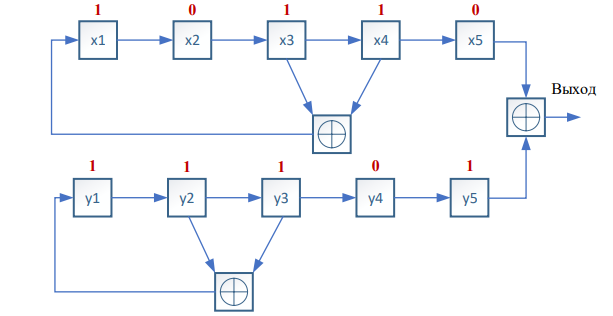
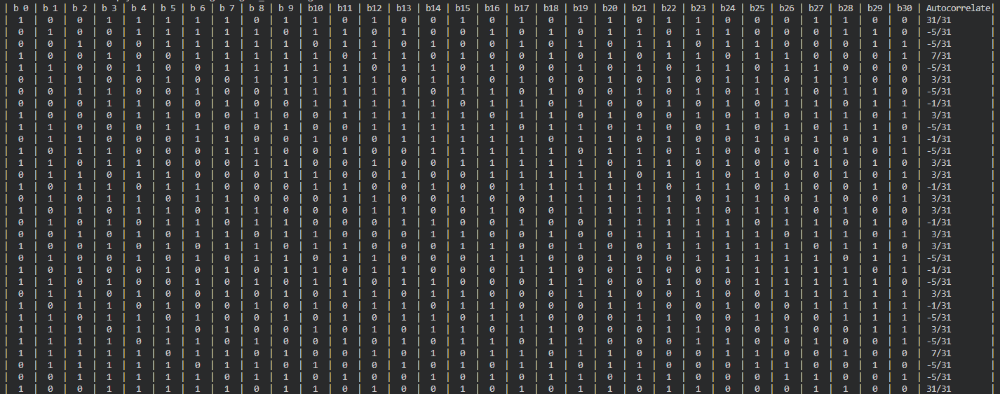

# Занятие №4. Изучение корреляционных свойств 
последовательностей, используемых для синхронизации в сетях мобильной 
связи

### Релизация на С
1) Напишите программу на языке С/С++ для генерации
последовательности Голда, используя схему:



- порождающие полиномы x и y :

```py
int x[] = {0,1,1,1,1};
int y[] = {1,0,1,1,0};
```
- Итоговая последовательность Голда:


2) Сделайте поэлементный циклический сдвиг последовательности и 
посчитайте автокорреляцию исходной последовательности и 
сдвинутой. Сформируйте таблицу с битовыми значениями 
последовательностей, в последнем столбце которой будет 
вычисленное значение автокорреляции.

- Формула Автокорреляции: 


- Таблица :



3) Сформируйте еще одну последовательность Голда, используя 
схему из 1 пункта, такую что x=x+1, а y= у-5

```py
int x1[] = {1,0,0,0,0};
int y1[] = {1,0,0,0,1};
```

- Новая последовательность:    1 0 0 0 0 0 1 0 0 0 1 1 1 0 0 0 0 0 1 1 1 1 0 1 0 0 0 0 0 0 1 

4) Вычислите значение взаимной корреляции исходной и новой 
последовательностей и выведите в терминал


### Релизация на Python


- функция автокорреляции в зависимости 
от величины задержки


