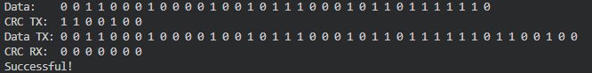
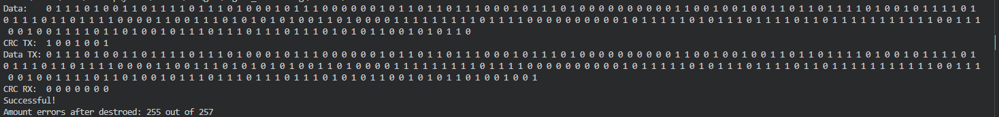

# Занятие №5. Циклический избыточный код. CRC

## 1 Задача
- Сформировали массив длинною 35 добавили 7 нулей 

- Последовательно делили исходные данные на полином G

- Остаток от деления приписали в конец массива исходных данных вместо нулей

- Еще раз применили деление на тот же полином и получили 7 нулей что свидетельствует об отстствии ошибок

## 2 Задача

- Зашли в цикл длинной N+CRC-1 на каждой итерации заменяли последовательно по одному биту у массива на прием и считали сколько раз приемник обнаружит ошибку.

